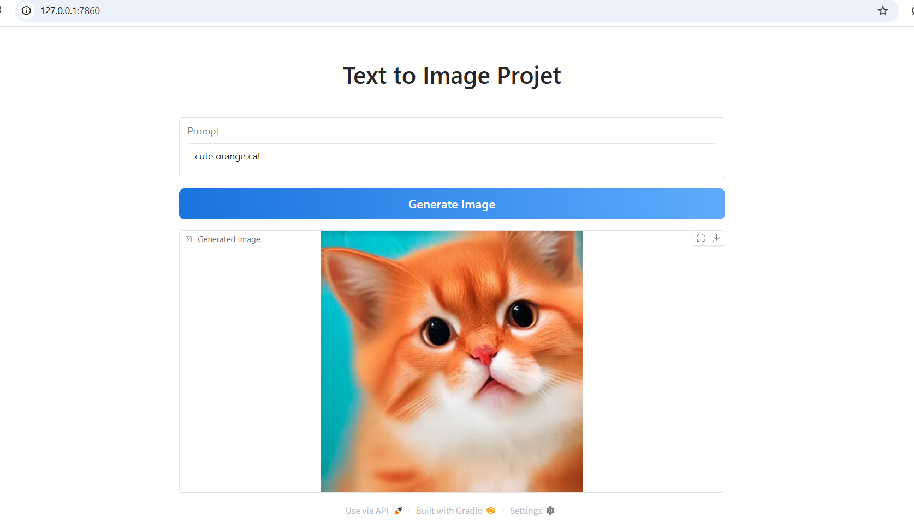

#  Text-to-Image Generation using Stable Diffusion 3 and LoRA

This project demonstrates how to generate images from text using **Stable Diffusion 3 (SD3)** with **LoRA fine-tuning**, and how to build an interactive web interface using **Gradio**.

---

##  Project Objectives

- Utilize a pre-trained SD3 model for text-to-image generation.
- Improve domain-specific performance via LoRA fine-tuning.
- Create a user-friendly Gradio interface for image generation.
- Enable CPU-based inference with acceptable quality and speed.

---

##  Source Code Overview

### `app.py` — Main Inference and UI Logic

```python
import torch
from diffusers import DiffusionPipeline
import gradio as gr

pipe = DiffusionPipeline.from_pretrained(
    "stabilityai/stable-diffusion-3-medium-diffusers",
    torch_dtype=torch.float32
).to("cpu")

pipe.load_lora_weights(
    "./trained-sd3-lora-miniature",
    weight_name="adapter_model.safetensors"
)

def generate_image(prompt, progress=gr.Progress()):
    progress(0, desc="Chargement...")
    image = pipe(prompt=prompt, height=384, width=384, num_inference_steps=10).images[0]
    return image

with gr.Blocks(css="""
#main {
    max-width: 800px;
    margin: auto;
    font-family: 'Segoe UI', sans-serif;
}
.gr-button.primary,.svelte-1ixn6qd {
    background: linear-gradient(to right, #1974dc, #5faaff) !important;
    color: white;
    border-radius: 8px;
    font-size: 1.1rem;
    padding: 0.75em 1.5em;
}
""") as demo:
    with gr.Column(elem_id="main"):
        gr.HTML("""<div style="text-align: center;">
            <h1>🖼️ SD3 Text-to-Image Generator</h1>
            <p>Powered by LoRA + Gradio</p>
        </div>""")
        prompt_input = gr.Textbox(label="Enter a prompt", placeholder="e.g. A photo of a cat with blue eyes")
        generate_button = gr.Button("Generate Image", elem_classes="primary")
        output_image = gr.Image(label="Generated Image")

        generate_button.click(fn=generate_image, inputs=prompt_input, outputs=output_image)

demo.launch()
```

---
##  Gradio Interface

Below are screenshots of the interface in action:

##  Gradio Interface

Below are screenshots of the interface in action:

### Interface Overview


### Generated Output Example


###  Demo

https://github.com/user-attachments/assets/51ca878c-c4f0-4208-9c3d-e98177c4f775


##  Development Environment Setup

### 1.  Required Python Packages

```bash
pip install diffusers==0.25.0 transformers accelerate bitsandbytes peft gradio wandb safetensors
```

### 2.  Hugging Face Authentication

To use the gated SD3 model:
- Accept the terms at: https://huggingface.co/stabilityai/stable-diffusion-3-medium-diffusers
- Login via CLI:
```bash
huggingface-cli login
```

---

##  Training Pipeline

### Step 1: Prepare Custom Dataset

- Folder: `./cat`
- File: `caption.json` format:
```json
{
  "cat1.jpg": "a photo of cat",
  "cat2.jpg": "a calico kitten with blue eyes"
}
```

### Step 2: Compute Embeddings

Use `compute_embeddings.py` to generate a `.parquet` file for training:
```bash
python compute_embeddings.py --input ./cat --output sample_embeddings.parquet
```

### Step 3: Launch Training

```bash
accelerate launch train_text_to_image_lora.py \
 --pretrained_model_name_or_path="stabilityai/stable-diffusion-3-medium-diffusers" \
 --instance_data_dir="./cat" \
 --output_dir="./trained-sd3-lora-miniature" \
 --instance_prompt="a photo of cat" \
 --resolution=1024 \
 --train_batch_size=1 \
 --gradient_accumulation_steps=4 \
 --learning_rate=1e-4 \
 --lr_scheduler="constant" \
 --lr_warmup_steps=0 \
 --use_8bit_adam \
 --mixed_precision="fp16"
```

---

##  Optional: Memory Management

```python
import torch, gc
def flush():
    torch.cuda.empty_cache()
    gc.collect()
```

---

##  Results

- LoRA noticeably enhances the model’s coherence.
- CPU-based inference feasible with optimizations.
- Gradio UI is intuitive and visually appealing.

---

##  References

- [Stable Diffusion 3](https://huggingface.co/stabilityai/stable-diffusion-3-medium-diffusers)
- [Diffusers Library](https://github.com/huggingface/diffusers)
- [LoRA Paper](https://arxiv.org/abs/2106.09685)
- [Gradio](https://www.gradio.app)
- [Stability AI](https://stability.ai)


---


